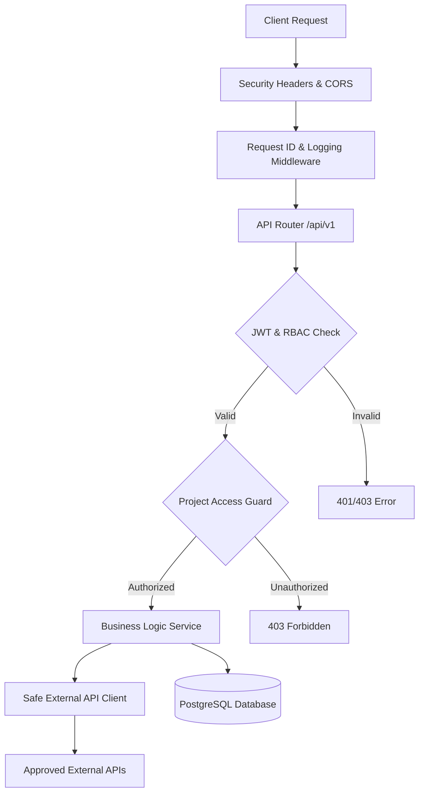

# 🛡️ Application Security & OWASP API Security Top 10 Matrix

This document details the security architecture, threat model, and OWASP API Security Top 10 mitigation matrix for the **Team Project Management API**.

---

## 📊 OWASP API Security Top 10 (2023) Compliance Matrix

| OWASP Vulnerability                                          | Threat / Description                                                                                                   | Applied Controls in Codebase                                                                                                                                                            | Verification Method                                                                |
| :----------------------------------------------------------- | :--------------------------------------------------------------------------------------------------------------------- | :-------------------------------------------------------------------------------------------------------------------------------------------------------------------------------------- | :--------------------------------------------------------------------------------- |
| **API1: Broken Object Level Authorization (BOLA)**           | Accessing or modifying objects belonging to other users or unauthorized project members.                               | `require_project_access` validates project membership and role-based access for protected project resources.                                                                            | OWASP security tests and authorization tests for unauthorized resource access.     |
| **API2: Broken Authentication**                              | Compromised credentials, invalid tokens, weak password protection, or token misuse.                                    | Argon2id password hashing, JWT access tokens with expiration, and hashed rotating refresh tokens with revocation.                                                                       | Authentication and token security tests, including invalid/expired token handling. |
| **API3: Broken Object Property Level Authorization (BOPLA)** | Mass assignment or unauthorized modification of sensitive object properties.                                           | Separate request/response schemas restrict which fields can be supplied by clients. Sensitive fields such as roles are not accepted through normal update schemas.                      | Security tests attempting unauthorized property modification such as `role`.       |
| **API4: Unrestricted Resource Consumption**                  | Excessive pagination, oversized searches, or unnecessarily large external responses.                                   | Pagination limits, bounded search/filter parameters, and response-size limits for external API consumption.                                                                             | Tests validating pagination limits and bounded resource usage.                     |
| **API5: Broken Function Level Authorization (BFLA)**         | Regular users accessing administrative functionality.                                                                  | Role-based access control using `require_roles()` and protected endpoint dependencies.                                                                                                  | Authorization tests using users with insufficient roles.                           |
| **API6: Unrestricted Access to Sensitive Business Flows**    | Abuse of sensitive operations such as authentication, token refresh, and resource creation.                            | Authentication controls, refresh-token revocation/rotation, role-based authorization, and input/resource limits.                                                                        | Security and authentication test suite covering protected business operations.     |
| **API7: Server-Side Request Forgery (SSRF)**                 | Using backend requests to access internal services, loopback addresses, private networks, or cloud metadata endpoints. | `validate_url_against_ssrf` uses an approved-domain allowlist and blocks private, loopback, link-local, and metadata IP ranges. Redirects are disabled and TLS verification is enabled. | SSRF validation tests for private and loopback addresses.                          |
| **API8: Security Misconfiguration**                          | Exposing internal errors, overly permissive CORS, or missing HTTP security controls.                                   | Centralized error handling, environment-based `ALLOWED_ORIGINS`, security headers, and sanitized 500 responses.                                                                         | Automated test suite and manual security review.                                   |
| **API9: Improper Inventory Management**                      | Undocumented, legacy, or unknown API endpoints.                                                                        | Versioned `/api/v1` endpoints, OpenAPI documentation, and `docs/api-inventory.md`.                                                                                                      | API inventory review against the application's documented routes.                  |
| **API10: Unsafe Consumption of APIs**                        | Blindly trusting external API responses or allowing unbounded external requests.                                       | `SafeAPIClient` uses connection/request timeouts, streaming response-size limits, TLS verification, and Pydantic response validation.                                                   | External API client security review and response-limit validation tests.           |

---

## 🔒 Security Architecture Highlights



---

## 🧪 Security Verification & Testing Guide

### Run the complete test suite

```bash
pytest -v
```

Current verification result:

```text
47 passed
```

### Run security and authorization tests

```bash
pytest -v -k "auth or security or permission or role"
```

### Static Security Analysis

Bandit was used to scan the application source code:

```bash
bandit -r app
```

Result:

* High severity: **0**
* Medium severity: **0**
* Low severity: **2**
* The two low-severity findings are false positives caused by the standard JWT token type value `"bearer"`.

### Dependency Vulnerability Scanning

```bash
pip-audit
```

Result:

```text
No known vulnerabilities found
```

### Secret Scanning

Gitleaks was used to scan the Git repository:

```bash
gitleaks git .
```

Result:

```text
51 commits scanned
no leaks found
```

---

## ✅ Security Verification Summary

| Security Check                | Result                     |
| :---------------------------- | :------------------------- |
| Automated Tests               | ✅ 47/47 Passed             |
| Bandit Static Analysis        | ✅ No High/Medium Issues    |
| pip-audit                     | ✅ No Known Vulnerabilities |
| Gitleaks                      | ✅ No Secrets Found         |
| JWT Authentication            | ✅ Implemented              |
| Argon2id Password Hashing     | ✅ Implemented              |
| RBAC Authorization            | ✅ Implemented              |
| BOLA Protection               | ✅ Implemented              |
| SSRF Protection               | ✅ Implemented              |
| Security Headers              | ✅ Implemented              |
| Centralized Error Handling    | ✅ Implemented              |
| Safe External API Consumption | ✅ Implemented              |

---

## 📌 Security Notes

* JWT signing secrets must be stored securely in environment variables and must not be committed to source control.
* Production `JWT_SECRET_KEY` should use a strong, randomly generated secret of at least 32 bytes.
* `.env` files and other secrets must not be committed to Git.
* CORS origins should be explicitly configured for production environments.
* Security tooling should be executed regularly as dependencies and source code evolve.
