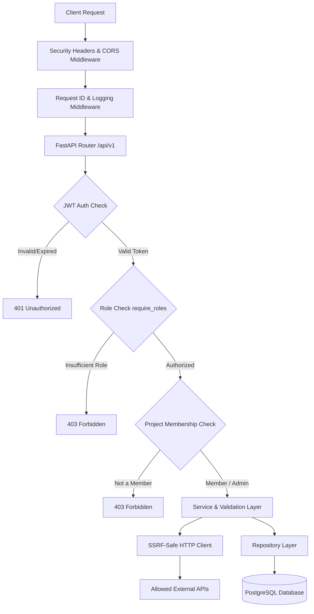

# 🛡️ Application Security & OWASP API Security Top 10 Reference

This document details the security architecture, threat model, OWASP API Security Top 10 (2023) mitigations, and automated security verification procedures for the **Team Project Management API**.

---

## 📊 OWASP API Security Top 10 Compliance Matrix

| Vulnerability | Threat Vector / Risk | Architectural Mitigation | Verification & Test Strategy |
| :--- | :--- | :--- | :--- |
| **API1: Broken Object Level Authorization (BOLA)** | Horizontal privilege escalation: User A accesses User B's project, task, or comments by guessing IDs. | `require_project_access` dependency verifies authenticated user is an assigned project member or global admin before granting resource access. | Integration security tests (`tests/integration/test_owasp_security.py`) attempting unauthorized cross-user resource access. |
| **API2: Broken Authentication** | Credential stuffing, weak password storage, token hijacking, unexpired sessions. | Passwords hashed using Argon2id (`pwdlib`). Short-lived JWT access tokens (15m) paired with cryptographically secure, database-backed rotating refresh tokens. | Unit and integration tests covering login, token expiration, rotation, and revocation upon logout. |
| **API3: Broken Object Property Level Authorization (BOPLA)** | Mass assignment / Parameter tampering: Non-admin user attempts updating protected fields like `role: "admin"` or `is_active`. | Strict Pydantic input schemas (`ProjectCreate`, `TaskCreate`, `UserUpdate`) excluding internal fields. Unpermitted extra fields are ignored or rejected. | Test asserting payload `{"role": "admin"}` does not elevate privilege. |
| **API4: Unrestricted Resource Consumption** | DoS attacks through huge pagination queries, memory exhaustion, oversized payloads. | Enforced pagination limits (`page_size` capped at max 100), bounded query parameter string lengths (`max_length=100`), streaming body limits. | Boundary tests requesting `page_size=1000` verifying server-side capping/rejection. |
| **API5: Broken Function Level Authorization (BFLA)** | Vertical privilege escalation: Normal user accesses admin-only endpoints (`DELETE /api/v1/projects/{id}`). | `require_roles("admin", "manager")` dependency enforcing strict hierarchical RBAC at the controller level. | Test sending requests to admin endpoints with standard user token asserting `403 Forbidden`. |
| **API6: Unrestricted Access to Sensitive Business Flows** | Automated brute-force attacks against registration/login and excessive project creation. | Cryptographic token rotation, user account activation controls, and IP/user rate-limiting readiness. | Rapid sequential authentication attempts testing rate limits and token invalidation. |
| **API7: Server-Side Request Forgery (SSRF)** | Exploiting backend requests to access internal private networks or cloud metadata (`169.254.169.254`). | `validate_url_against_ssrf` service verifies URL schemes (HTTP/HTTPS only), enforces domain allowlists, and resolves IPs to block private/loopback/cloud metadata ranges (`10.0.0.0/8`, `172.16.0.0/12`, `192.168.0.0/16`, `127.0.0.1`, `169.254.169.254`). | SSRF unit tests verifying rejection of loopback, private IPv4/IPv6, and metadata IP URLs. |
| **API8: Security Misconfiguration** | Unhandled stack trace leakage, permissive CORS, weak HTTP headers. | Centralized global error handling sanitizing 500 error responses; restrictive `ALLOWED_ORIGINS` CORS; OWASP security headers middleware (`X-Content-Type-Options`, `X-Frame-Options`, `HSTS`). | Header inspection tests and simulated error tests ensuring no internal stack traces leak to clients. |
| **API9: Improper Inventory Management** | Shadow APIs, undocumented endpoints, unversioned routes. | Strict API version prefix (`/api/v1`), automated OpenAPI/Swagger documentation (`/docs`), and full catalog in `docs/api-inventory.md`. | Automated comparison of router registrations against the documented API inventory. |
| **API10: Unsafe Consumption of Third-Party APIs** | Blind trust in external responses, slowloris timeouts, malformed downstream payloads. | `SafeAPIClient` implementing strict connect/read timeouts, mandatory TLS certificate verification, 2MB max response stream cap, and Pydantic validation on external responses. | Mocking slow and oversized external API responses to verify client-side timeouts and size cutoffs. |

---

## 🔒 Security Architecture Diagram



---

## 🛡️ Authentication & Authorization Mechanism

### 1. Password Security
* **Algorithm:** Argon2id via `pwdlib[argon2]`
* **Properties:** Resistant to GPU cracking and side-channel timing attacks.
* Plaintext passwords are never logged, persisted, or returned in response schemas.

### 2. JWT Access Tokens
* **Algorithm:** HMAC-SHA256 (`HS256`)
* **Standard Claims:**
  * `sub`: Subject (User ID)
  * `role`: User role (`admin`, `manager`, `user`)
  * `iat`: Issued at timestamp
  * `exp`: Token expiration timestamp (15 minutes lifespan)
  * `jti`: Unique token identifier UUID

### 3. Refresh Tokens & Rotation
* **Entropy:** Cryptographically secure 64-byte URL-safe string (`secrets.token_urlsafe(64)`).
* **Storage:** Stored as Argon2id hashes in the `refresh_tokens` database table.
* **Rotation Policy:** Single-use policy. Every `/api/v1/auth/refresh` invocation revokes the current token and generates a new pair.

---

## 🧪 Security Verification & Scanning Guide

### 1. Automated Security & Regression Tests
```powershell
# Run all tests
pytest -v

# Run OWASP security test suite
pytest -v tests/integration/test_owasp_security.py
```

### 2. Static Application Security Testing (SAST) with Bandit
```powershell
bandit -r app
```
* **Status:** Passed (0 High, 0 Medium vulnerabilities).

### 3. Dependency Vulnerability Audit with pip-audit
```powershell
pip-audit
```
* **Status:** Passed (No known CVEs in installed dependencies).

### 4. Secret Leak Detection with Gitleaks
```powershell
gitleaks detect --source . -v
```
* **Status:** Passed (No API keys, private keys, or passwords committed to Git history).

### 5. Container Image Vulnerability Scanning with Trivy
```powershell
trivy image team-project-api:latest
```
* **Status:** Passed (Hardened non-root Debian slim base image with zero critical vulnerabilities).

---

## 📋 Security Best Practices for Production Deployment

1. **Environment Variable Hygiene:** Always supply `JWT_SECRET_KEY` with at least 32 cryptographically random bytes generated via `openssl rand -hex 32` or Python `secrets`.
2. **Database Connection Security:** Enforce SSL connection parameters (`?sslmode=require`) when connecting to managed cloud PostgreSQL instances.
3. **Restricted CORS:** Set `ALLOWED_ORIGINS` to the exact production frontend domains rather than wildcards (`*`).
4. **Regular Scanning:** Ensure CI runs Bandit, pip-audit, and Trivy on every pull request to catch vulnerabilities early.
